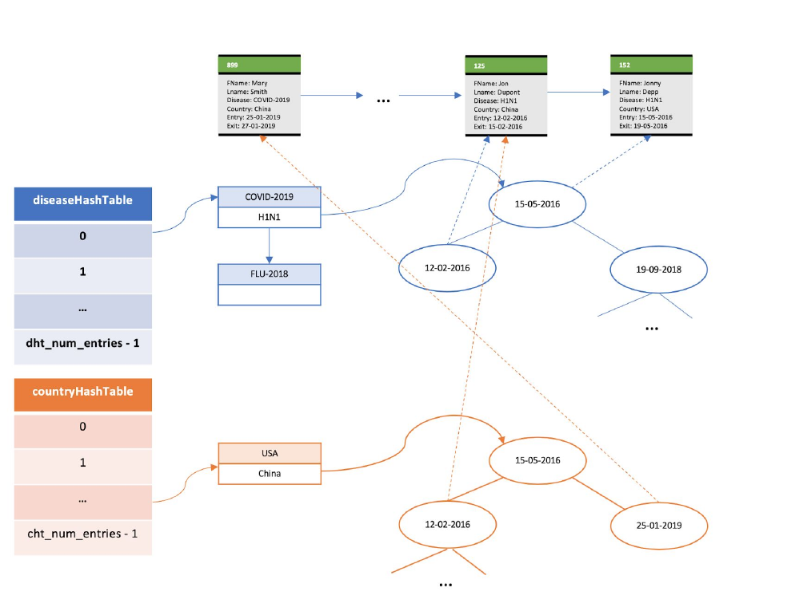

# DiseaseMonitor


## For compilation:  

```bash
make
```

## To delete binaries and executable:  

```bash
make clean
```

To run:  

```bash
./diseaseMonitor -p patientRecordsFile –h1 diseaseHashtableNumOfEntries –h2 countryHashtableNumOfEntries –b bucketSize**
```
The repo contains a patient record file named small.txt for testing
  


Returns results from queries applied on a file with patient data in the form of: PatiendID firstName lastName disease country admission-date release-date
Examples:

  889 Mary Smith COVID-2019 China 25-1-2019 27-1-2019
  776 Larry Jones SARS-1 Italy 10-02-2003 –
  125 Jon Dupont H1N1 USA 12-02-2016 15-02-2016

Schema of the data structures used:


